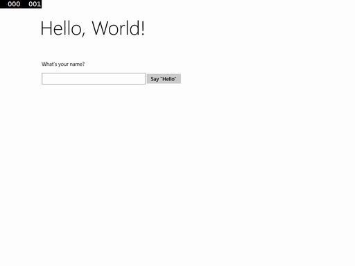
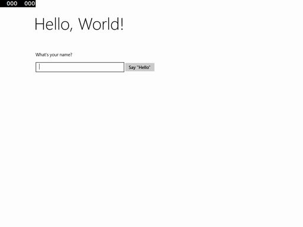
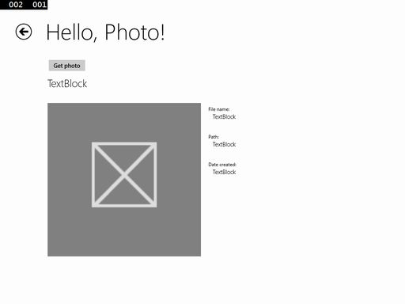
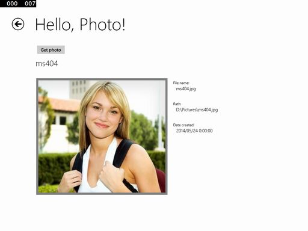
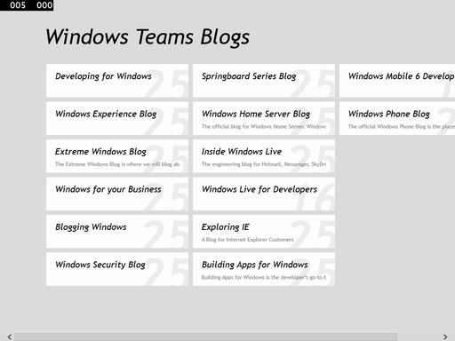

# Windows ストアアプリチュートリアル
残骸

----
## 動作環境
* Windows 8.1
* Visual Studio 2013

----
## 内容
*  "Hello, world" アプリを作成する ([チュートリアルページ](http://msdn.microsoft.com/ja-jp/library/windows/apps/hh986965.aspx))
*  アプリのライフサイクルと状態を管理する ([チュートリアルページ](http://msdn.microsoft.com/ja-jp/library/windows/apps/hh986968.aspx))
*  ナビゲーション、レイアウト、ビュー ([チュートリアルページ](http://msdn.microsoft.com/ja-jp/library/windows/apps/jj215600.aspx))
*  ファイルアクセスとファイルピッカー ([チュートリアルページ](http://msdn.microsoft.com/ja-jp/library/windows/apps/jj655411.aspx))
*  ブログリーダーを作成する ([チュートリアルページ](http://msdn.microsoft.com/ja-jp/library/windows/apps/br211380.aspx))
